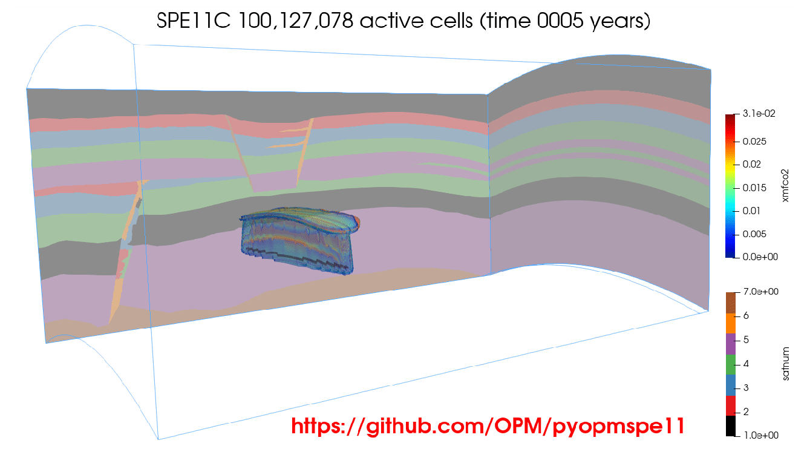

[](https://github.com/OPM/pyopmspe11/actions/workflows/CI.yml)
<a href="https://www.python.org/"></a>
[](https://github.com/ambv/black)
[](https://opensource.org/license/mit/)

# pyopmspe11: A Python framework using OPM Flow for the SPE11 benchmark project



This repository contains scripts to set up a workflow using Python for the three cases in the [_SPE11 project_](https://www.spe.org/en/csp/).
Here we use the [_OPM-Flow_](https://opm-project.org/?page_id=19) simulator.

## Installation
You will first need to install
* Flow (https://opm-project.org, Release 2024.10 or current master branches)

To install the _pyopmspe11_ executable from the development version: 

```bash
pip install git+https://github.com/OPM/pyopmspe11.git
```

If you are interested in a specific version (e.g., v2024.04) or in modifying the source code, then you can clone the repository and install the Python requirements in a virtual environment with the following commands:

```bash
# Clone the repo
git clone https://github.com/OPM/pyopmspe11.git
# Get inside the folder
cd pyopmspe11
# For a specific version (e.g., v2024.04), or skip this step (i.e., edge version)
git checkout v2024.04
# Create virtual environment (to specific Python, python3.12 -m venv vpyopmspe11)
python3 -m venv vpyopmspe11
# Activate virtual environment
source vpyopmspe11/bin/activate
# Upgrade pip, setuptools, and wheel
pip install --upgrade pip setuptools wheel
# Install the pyopmspe11 package
pip install -e .
# For contributions/testing/linting, install the dev-requirements
pip install -r dev-requirements.txt
``` 

See the [_installation_](https://OPM.github.io/pyopmspe11/installation.html) for further details on building OPM Flow from the master branches in Linux, Windows, and macOS, as well as the OPM Python package and LaTeX dependencies.

## Running pyopmspe11
You can run _pyopmspe11_ as a single command line:
```
pyopmspe11 -i configuration_file
```
Run `pyopmspe11 --help` to see all possible command line 
argument options. Inside the `configuration_file` you provide the path to the flow executable and simulation parameters. See the .txt and .toml files in the [_examples_](https://github.com/OPM/pyopmspe11/tree/main/examples), [_benchmark_](https://github.com/OPM/pyopmspe11/tree/main/benchmark), and [_tests_](https://github.com/OPM/pyopmspe11/tree/main/tests/configs) folders.

## Getting started
See the [_examples_](https://OPM.github.io/pyopmspe11/examples.html) in the [_documentation_](https://OPM.github.io/pyopmspe11/introduction.html). 

## About pyopmspe11
The pyopmspe11 package is being funded by the [_HPC Simulation Software for the Gigatonne Storage Challenge project_](https://www.norceresearch.no/en/projects/hpc-simulation-software-for-the-gigatonne-storage-challenge) [project number 622059] and [_Center for Sustainable Subsurface Resources (CSSR)_](https://cssr.no) 
[project no. 331841].
This is work in progress. [_Here_](https://www.spe.org/en/csp/) is the link to the SPE11 details.
Contributions are more than welcome using the fork and pull request approach.
For a new feature, please request this by raising an issue.