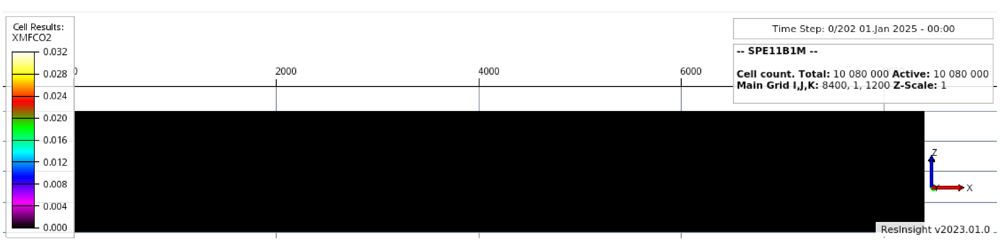

[](https://github.com/daavid00/pyopmcsp11/actions/workflows/CI.yml)
<a href="https://www.python.org/"></a>
[](https://github.com/ambv/black)
[](https://opensource.org/license/mit/)

# pyopmcsp11: A Python framework using OPM Flow for the CSP11 benchmark project



This repository contains scripts to set up a workflow in python for the three cases in the CSP11 project.
Here we use the [_OPM-Flow_](https://opm-project.org/?page_id=19) simulator.

## Installation
You will first need to install
* Flow (https://opm-project.org)

To build dune and the corresponding OPM master branches from source (e.g., you are a macOS user), you can run the script
`./build_dune_and_opm-flow.bash`, which in turn should build flow in the folder 
./build/opm-simulators/bin/flow (for macOS users the dependecies such as boost can be installed using brew or macports).

You can install the requirements in a virtual environment with the following commands:

```bash
# Clone the repo
git clone https://github.com/daavid00/pyopmcsp11.git
# Get inside the folder
cd pyopmcsp11
# Create virtual environment
python3 -m venv vpyopmcsp11
# Activate virtual environment
source vpyopmcsp11/bin/activate
# Upgrade pip, setuptools, and wheel
pip install --upgrade pip setuptools wheel
# Install the pyopmcsp11 package (in editable mode for contributions/modifications, i.e., pip install -e .)
pip install .
# For contributions/testing/linting, install the dev-requirements
pip install -r dev-requirements.txt
``` 

See the [_CI.yml_](https://github.com/daavid00/pyopmcsp11/blob/main/.github/workflows/CI.yml) script
for installation of OPM Flow and the pyopmcsp11 package in ubuntu.

## Running pyopmcsp11
You can run _pyopmcsp11_ as a single command line:
```
pyopmcsp11 -i some_input.txt -o some_output_folder
```
Run `pyopmcsp11 --help` to see all possible command line 
argument options. Inside the `some_input.txt` file you provide the path to the
flow executable and simulation parameters. See the .txt files in the examples
folders.

## Running in a docker

Docker container allows to run opm inside an encapsulated environment. To use it either pull the public [docker image](https://hub.docker.com/r/jafranc/opm-u22-spe11csp) 

```
	docker pull jafranc/opm-u22-spe11csp
```

or build it from the source _omp-spe11csp-ubuntu.Dockerfile_ located at _./dockers_ with command:

```
	cd dockers
	docker build --build-arg IMG=ubuntu --build-arg VERSION=jammy -t <tag-docker> -f omp-spe11csp-ubuntu.Dockerfile .
```

Then using `docker images`, the created or pulled image should be visible. Running the data generator and simulation for a case is then done by

```
	docker run -e SPE_CASE=<a,b or c> -v <host-path-to-result>:/opt/spe11csp/output_csp11<a,b or c> <tag-docker> 

```

Then you can inspect what has been produced at \<host-path-to-result\>. \<tag-docker\> being the tag you choose when building the image or if pulled from _docker://_ , _jafranc/opm-u22-spe11csp:latest_. Eventually \<a,b or c\> will set a variable in the docker container generating and running the simulation either for csp SPE 11th case a (2D surface conditions), case b (2D reservoir conditions) or c (3D extruded reservoir conditions). 

Results can be visualized using [ResInsight](https://resinsight.org/) or other viewers.


## Getting started
See the [_documentation_](https://daavid00.github.io/pyopmcsp11/introduction.html).

## About pyopmcsp11
The pyopmcsp11 package is being funded by the [_HPC Simulation Software for the Gigatonne Storage Challenge project_](https://www.norceresearch.no/en/projects/hpc-simulation-software-for-the-gigatonne-storage-challenge) [project number 622059] and [_Center for Sustainable Subsurface Resources (CSSR)_](https://cssr.no) 
[project no. 331841].
This is work in progress. [_Here_](https://www.spe.org/en/csp/) is the link to the csp11 details.
Contributions are more than welcome using the fork and pull request approach.
