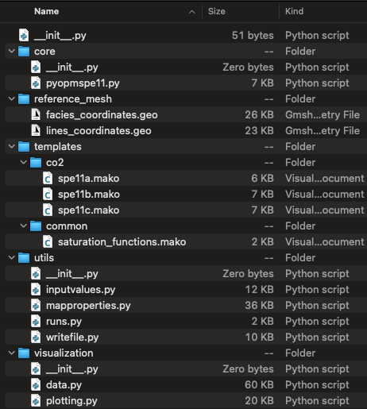

=====================
pyopmcsp11 Python API
=====================

The main script for the **pyopmcsp11** executable is located in the core folder.
The reference_mesh folder contains `Gmsh <https://gmsh.info>`_ files to obtain the
coordinates used for the location of the different facies and generation of the corner-point grid.
The scripts in the utils folder process the input configuration
file, creates the geological model, and write the input files by using the files in the templates folder.
The visualization folder contains files for the postprocessing of the results (currently only
to plot 2D spatial maps for the last time step simulated.)

    Files in the pyopmcsp11 package.

.. include:: modules.rst