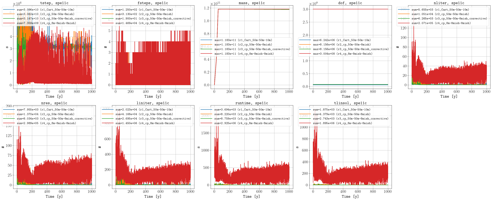

*********
Benchmark
*********

.. note::
    These are preliminary results and will be updated up to the final submission deadline (September 20th 2024, see `here <https://connect.spe.org/discussion/update-on-spe11-submission-and-workshops#bm94ca322f-a2f3-421b-9f90-0191376f7b25>`_).
    For example, new simulations for the spe11a result3 and spe11c result3 are still running to handle the mass issue and to include the 1000 years of initialization time, respectively. 

The configuration files are located in the `benchmark <https://github.com/OPM/pyopmspe11/blob/main/benchmark>`_ folder.

======
SPE11A
======

.. figure:: figs/benchmark_spe11a_sparse_data.png

======
SPE11B
======

.. figure:: figs/benchmark_spe11b_performance.png
.. figure:: figs/benchmark_spe11b_sparse_data.png

======
SPE11C
======

.. figure:: figs/benchmark_spe11c_sparse_data.png