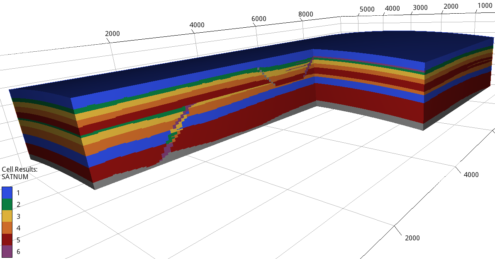
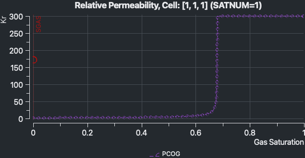

==================
Configuration file
==================

The first input parameter in the configuration file is:

.. code-block:: python
    :linenos:

    """Set the full path to the flow executable and flags"""
    flow --linear-solver=cprw --enable-tuning=true --enable-opm-rst-file=true --output-extra-convergence-info=steps,iterations  --enable-well-operability-check=false --min-time-step-before-shutting-problematic-wells-in-days=1e-99 

If **flow** is not in your path, then write the full path to the executable
(e.g., /Users/dmar/opm/build/opm-simulators/bin/flow). We also add in the same 
line as many flags as required (see the OPM Flow documentation `here <https://opm-project.org/?page_id=955>`_).

.. note::
    If you have installed flow with MPI support, then you can run the simulations in
    parallel by adding **mpirun -np N flow ...** where N is the number of cpus.

****************************
Reservoir-related parameters
****************************

The following input lines in the configuration file are:

.. code-block:: python
    :linenos:
    :lineno-start: 4

    """Set the model parameters"""
    spe11c master     #Name of the spe case (spe11a, spe11b, or spe11c) and OPM Flow version (master or release)
    complete gaswater #Name of the co2 model (immiscible or complete) and co2store implementation (gaswater or gasoil [oil properties are set to water internally in OPM flow])
    cartesian         #Type of grid (cartesian, tensor, or corner-point)
    8400 5000 1200    #Length, width, and depth [m]
    84                #If cartesian, number of x cells [-]; otherwise, variable array of x-refinment
    50                #If cartesian, number of y cells [-]; otherwise, variable array of y-refinment [-] (for spe11c)
    12                #If cartesian, number of z cells [-]; if tensor, variable array of z-refinment; if corner-point, fix array of z-refinment (18 entries)
    70 36.25          #Temperature bottom and top rig [C]            
    19620000 0.1      #Pressure on the top [Pa] and multiplier for the permeability in the z direction [-]
    1e-9 2e-8 0       #Diffusion (in liquid and gas) [m^2/s] and dispersion [m] (disperison only available in Flow master)
    8.5e-1 2500       #Rock specific heat and density (for spe11b/c)
    0 5e4 1           #Added pore volume on top boundary (for spe11a [if 0, free flow bc]), pore volume on lateral boundaries, and width of buffer cell [m] (for spe11b/c)
    150 10            #Elevation of the parabola and back [m] (for spe11c) 

In line 5 you specify if you are using OPM Flow from the master branch or from the latest stable release (OPM-flow 2023.10 release).
This since there are continuous changues in the OPM master branch (e.g., implementation of mechanical dispersion). Then we 
will keep updating the decks for using Flow from master and also we will keep the framework to produce decks compatible for the latest OPM stable release.
The immiscible model allows for faster prototyping while the complete model includes dissolution of the components in the
gas and liquid phases, in addition to thermal effects. Regarding the grid type, the cartesian mode generates an uniform grid
with the defined number of elements in lines 9 to 11. The tensor grid allows to define arrays in each direction where the grid
is first divided with the number of entries in the array, and after it divides each of these elements by the assigned number in 
the array entry. The corner-point mode generates a grid where the x and y direction are defined as in the array mode, but the 
cell faces in the z-direction follows the lines as defined in the `lines_coordinates.geo <https://github.com/OPM/pyopmspe11/blob/main/src/pyopmspe11/reference_mesh/lines_coordinates.geo>`_ script,
resulting in 18 levels. Then, the z-refinment in each of these levels is set. See the configuration files in the `tests <https://github.com/OPM/pyopmspe11/blob/main/tests>`_ and 
`examples <https://github.com/OPM/pyopmspe11/blob/main/examples>`_ folder for the setting of these grids.

.. figure:: figs/tensor.png
.. figure:: figs/corner.png

    Examples of a cartesian (top), tensor (middle), and corner-point (bottom) grids. The cartesian is generated using 170, 100, and 120
    elements, the tensor grid by setting the x-array to 50,100,20; the y-array to 5,10,70,10,5; and the z-array to 5,10,20,20,20,20,20,5; and 
    the corner-point grid using the same xy-arrays as in the tensor grid and for the z-refinment 4,4,3,3,5,3,7,5,13,5,4,3,5,3,9,21,21,2. 

.. warning::
    Dispersion seems to work fine for the spe11a case where there are no thermal effects nor water evaporation. However, for spe11b/c there are
    issues with the current implementation (we are working in this, then for now disperison should be set to 0 for spe11b/c).  

***********************
Soil-related parameters
***********************
The following entries define the properties of the different facies:

.. code-block:: python
    :linenos:
    :lineno-start: 19

    """Set the saturation functions"""
    (max(0, (s_w - swi) / (1 - swi))) ** 1.5                                                        #Wetting rel perm saturation function [-]
    (max(0, (1 - s_w - sni) / (1 - sni))) ** 1.5                                                    #Non-wetting rel perm saturation function [-]
    penmax * math.erf(pen * ((s_w-swi) / (1.-swi)) ** (-(1.0 / 1.5)) * math.pi**0.5 / (penmax * 2)) #Capillary pressure saturation function [Pa]
    (np.exp(np.flip(np.linspace(0, 5.0, npoints))) - 1) / (np.exp(5.0) - 1)                         #Points to evaluate the saturation functions (s_w) [-]

    """Properties sat functions"""
    """swi [-], sni [-], pen [Pa], penmax [Pa], npoints [-]"""
    SWI1 0.32 SNI1 0.1 PEN1 193531.39 PENMAX1 3e7 NPOINTS1 200000 
    SWI2 0.14 SNI2 0.1 PEN2   8654.99 PENMAX2 3e7 NPOINTS2 200000 
    SWI3 0.12 SNI3 0.1 PEN3   6120.00 PENMAX3 3e7 NPOINTS3 200000 
    SWI4 0.12 SNI4 0.1 PEN4   3870.63 PENMAX4 3e7 NPOINTS4 200000 
    SWI5 0.12 SNI5 0.1 PEN5   3060.00 PENMAX5 3e7 NPOINTS5 200000 
    SWI6 0.10 SNI6 0.1 PEN6   2560.18 PENMAX6 3e7 NPOINTS6 200000 
    SWI7    0 SNI7   0 PEN7         0 PENMAX7 3e7 NPOINTS7      2

    """Properties rock"""
    """K [mD], phi [-], thconr [W m-1 K-1]"""
    PERM1 0.10132 PORO1 0.10 THCONR1 1.90
    PERM2 101.324 PORO2 0.20 THCONR2 1.25
    PERM3 202.650 PORO3 0.20 THCONR3 1.25
    PERM4 506.625 PORO4 0.20 THCONR4 1.25
    PERM5 1013.25 PORO5 0.25 THCONR5 0.92
    PERM6 2026.50 PORO6 0.35 THCONR6 0.26
    PERM7       0 PORO7    0 THCONR7 2.00

.. figure:: figs/kr.png

    Visualization in ResInsight of the relative permeability and capillary pressure functions in the facie 1.

***********************
Well-related parameters
***********************
The last part of the configuration file sets the wells radius, location, and the injection schedule.

.. code-block:: python
    :linenos:
    :lineno-start: 45

    """Wells radius and position"""
    """radius, x, y, and z position [m] (final positions as well for spe11c)"""
    0.15 2700. 1000. 300. 2700. 4000. 300. #Well 1 
    0.15 5100. 1000. 700. 5100. 4000. 700. #Well 2 

    """Define the injection values ([hours] for spe11a; [years] for spe11b/c)""" 
    """injection time, time step size to write results, maximum solver time step, injected fluid (0 water, 1 co2) (well1), injection rate [kg/s] (well1), temperature [C] (well1), injected fluid (0 water, 1 co2) (well2), ..."""
    995 995  1 0     0 10 0     0 10
      5   5  1 0     0 10 0     0 10
     25   5 .1 1    50 10 0     0 10
     25   5 .1 1    50 10 1    50 10
    950   5  1 0     0 10 0     0 10
    
.. warning::
    Keep the linebreak between the sections (in the current implementation this is used for the reading of the parameters).