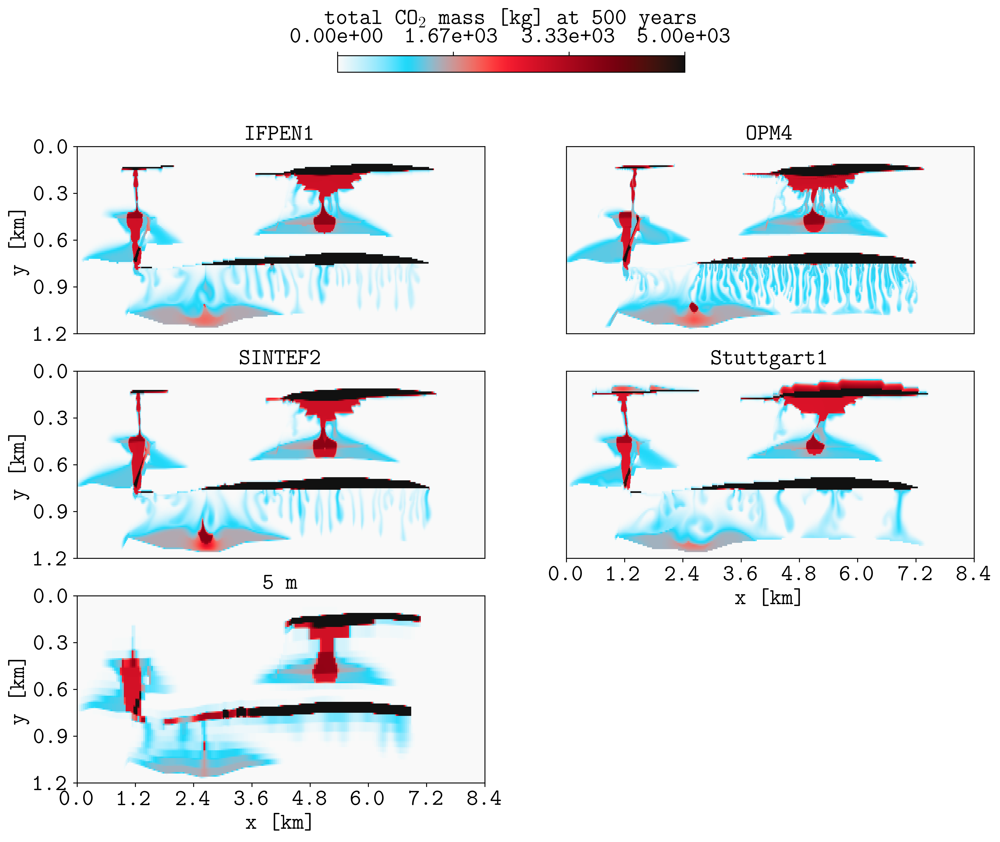
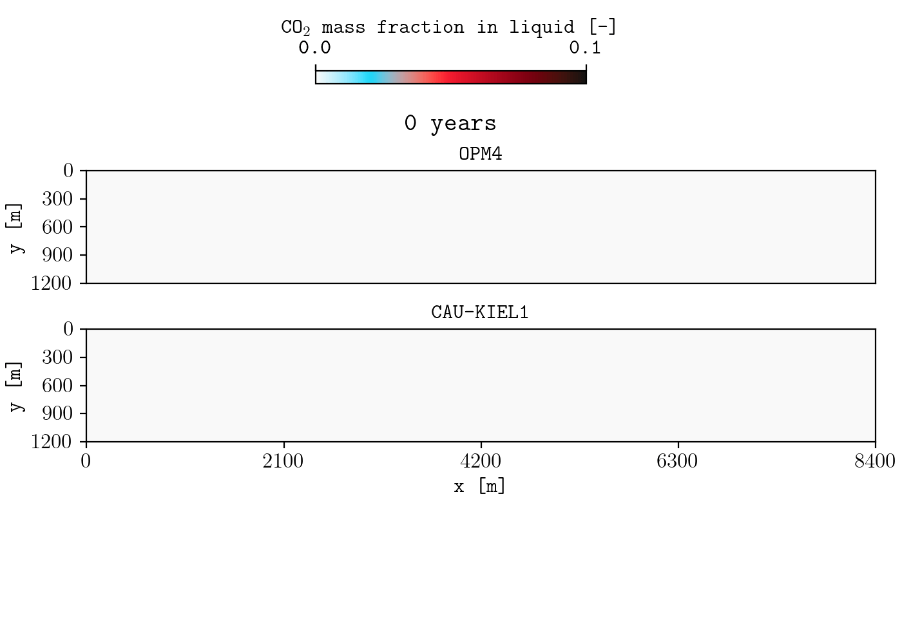

***********
Convergence
***********

This section describes how to run the cases in the paper `Exploring Convergence and Its Limits in Case B of the 11th SPE Comparative Solution Project, to appear in SPE J`.

To run the cases in the terminal, inside the `convergence <https://github.com/OPM/pyopmspe11/blob/main/convergence>`_ folder:

.. code-block:: bash

   python3 convergence.py

`plopm <https://github.com/cssr-tools/plopm>`_ is used to generate the figures, which can be installed by executing in the terminal:
    
.. code-block:: bash
    
    pip install git+https://github.com/cssr-tools/plopm.git

The cases are run with 8 cpus, then you can remove or increase this in the `spe11b.mako <https://github.com/OPM/pyopmspe11/blob/main/convergence/spe11b.mako>`_ template.

===========
Full domain
===========

These cases are run in the grid sizes of 40, 20, 10, and 5 meters. To simulate additional refinements, edit the 'sizes' variable in `convergence.py <https://github.com/OPM/pyopmspe11/blob/main/convergence/convergence.py>`_.

.. figure:: figs/convergence_moba.png
    
    (Left) mobile CO2 in box A for the four different refinements and (right) adding all participants (time axis in log scale).

.. image:: figs/full_spatial_map_adding_participants.png

As shown in these figures, in the convergence.py script the SPE11B benchmark data from the participants is donwloaded and used to compare the results. To achive this,
the functionality of **plopm** to read csv files is used (see the commands inside the convergence.py script), which provides flexibility to edit the format of the figures (e.g., color, width, and style of the lines, to which participant compare the results, etc.).
For example, executing the following line generates the figure below, where the result at grid resolution 5 m is compared to the selected participants in Fig. 7 in the `the SPE11 benchmark paper <https://www.sciencedirect.com/science/article/pii/S1750583625002178>`_:

.. code-block:: bash
    
    plopm -i "spe11b/ifpen1/spe11b_spatial_map_500y spe11b/opm4/spe11b_spatial_map_500y spe11b/sintef2/spe11b_spatial_map_500y spe11b/stuttgart1/spe11b_spatial_map_500y full_cp0-z40mish-x40m/spe11b_spatial_map_500y"  -csv "1,2,9" -subfigs 3,2 -delax 1 -suptitle 0 -z 0 -cbsfax 0.35,0.97,0.3,0.02 -yunits km -xunits km -yformat .1f -f 20 -xformat .1f -cnum 4 -xlnum 8 -cformat .2e -d 14,10 -t "IFPEN1  OPM4  SINTEF2  Stuttgart1  5 m" -clabel 'total CO$_2$ mass [kg] at 500 years' -c cet_CET_CBTL1_r -b '[0,5e3]'

To compare the mobB quantity for these results:

.. code-block:: bash
    
    plopm -i "spe11b/ifpen1/spe11b_time_series spe11b/opm4/spe11b_time_series spe11b/sintef2/spe11b_time_series spe11b/stuttgart1/spe11b_time_series full_cp0-z40mish-x40m/spe11b_time_series"  -csv "1,9" -labels "IFPEN1  OPM4  SINTEF2  Stuttgart1  5 m" -ylabel "mobB [kg]" -tunits y -xformat .0f -x '[0,1000]' -lw 5 -e solid

.. image:: figs/spe11b_time_series_csv.png

In general to generate a GIF and compare results, **plopm** can also be used. For example here we compare OPM4 and CAU-KIEL1 every 25 years (note that 'PLOPM' is written in the csv file name to read the values to plot given by the flag **-r**, in this example every 25 years):

.. code-block:: bash
    
    plopm -i 'spe11b/opm4/spe11b_spatial_map_PLOPMy spe11b/cau-kiel1/spe11b_spatial_map_PLOPMy' -r 0:1000:25 -csv '1,2,5' -m gif -interval 1000 -loop 1 -subfigs 2,1 -tunits years -t 'OPM4  CAU-KIEL1' -c cet_CET_CBTL1_r -clabel 'CO$_2$ mass fraction in liquid [-]' -cbsfax 0.35,0.87,0.3,0.02 -delax 1

.. tip::

    See the `plopm online docmunetation <https://cssr-tools.github.io/plopm/>`_ for additional information of supported flag parameters to generate customized PNGs and GIFs.

============
Lower domain
============

These cases are run in the grid sizes of 320, 160, 80, 40, 20, 10, and 5 meters. Here a different colormap than the paper is used, given as
a command flag parameter to **plopm** ('-c cet_CET_L19' in line 42 of convergence.py instead of '-c cet_CET_CBTL1_r'). 

.. figure:: figs/lower_spatial_map_all.png
