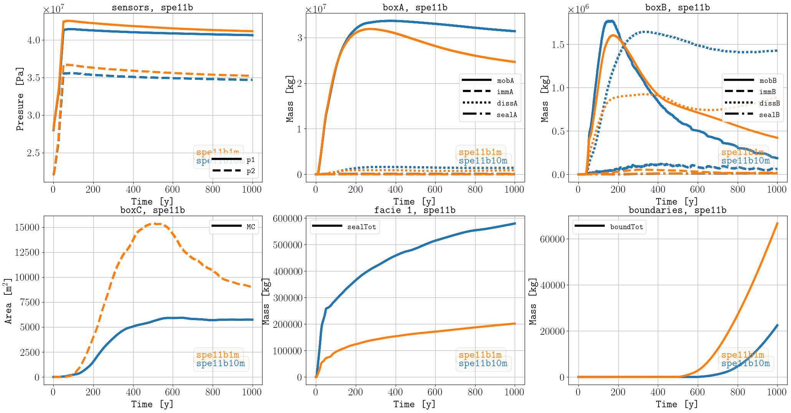
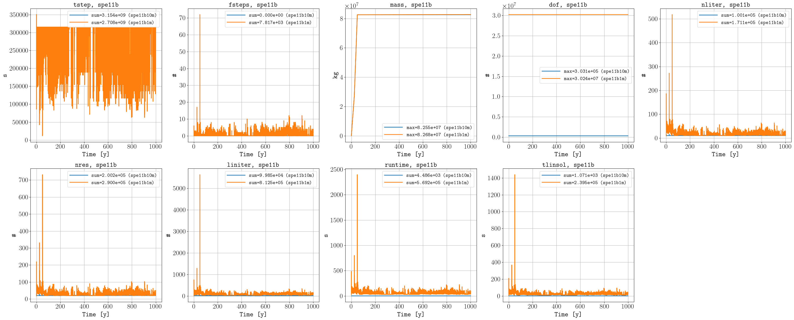
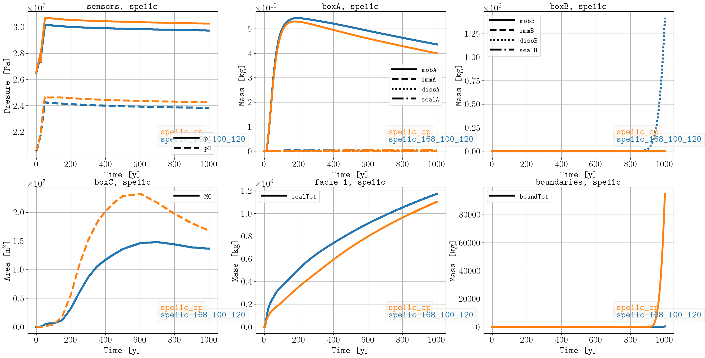
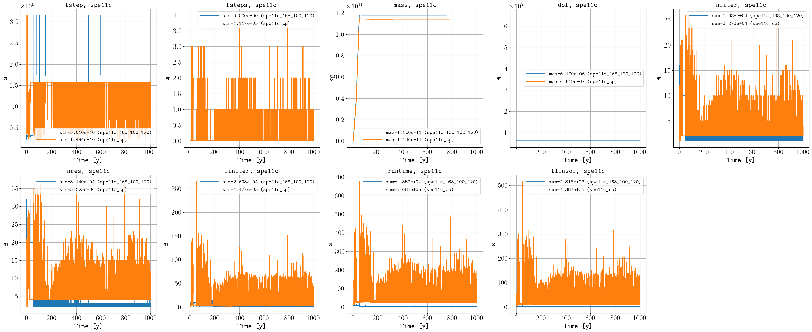
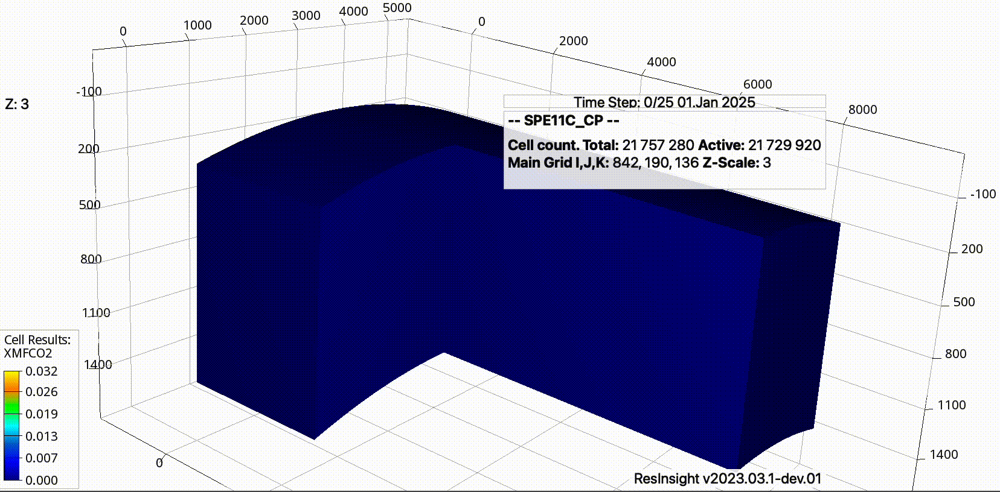

********
Examples
********

===========
Hello world 
===========

The `examples/hello_world <https://github.com/OPM/pyopmspe11/blob/main/examples/hello_world>`_ folder contains configuration files
with low grid resolution and shorter injetion times (for initial testing of the framework). For example, by executing:

.. code-block:: bash

    pyopmspe11 -i spe11b.txt -o spe11b -m all -g all -t 5 -r 50,1,15 -w 1

The following is one of the figures generated related to the CO2 mass in the domain over time (i.e., the simulations results from
the corner-point grid mapped to the equidistance reporting grid of 50 x 15 as defined by the -r flag):

.. figure:: figs/spe11b_tco2_2Dmaps.png

Let us now change the grid type from corner-point to tensor in line 7 of the configuration file.
Then, we run the simulations and we save the results in a different output folder:

.. code-block:: bash

    pyopmspe11 -i spe11b.txt -o tensor -m deck_flow_data -g performance_sparse -t 5 -r 50,1,15 -w 1

Here we have just set the framework to generate the deck, run the simulations, and generate the performance and sparse data.
Then, to visualize the comparison between both runs, this can be achived by executing:

.. code-block:: bash

    pyopmspe11 -c spe11b

The following are some of the figures generated in the compare folder:

.. figure:: figs/spe11b_performance.png
.. figure:: figs/spe11b_sparse_data.png

This example uses a very coarser grid to run fast. See the following section for finer grids. 

.. warning::
    There have been two bug fixes that will change some of the results below (see `this <https://github.com/OPM/pyopmspe11/pull/54>`_
    and `this PR <https://github.com/OPM/pyopmspe11/pull/55>`_). We will remove this warning once we have rerun the cases and updated
    the results here. Please use a version of pyopmspe11 after 13.06.2024, which includes the fixes to these two issues. 

======
SPE11A
======

In a 1 mm Cartesian grid for the spe11a `(spe11a1mm.txt) <https://github.com/OPM/pyopmspe11/blob/main/examples/finner_grids/spe11a1mm.txt>`_
and in a 1 cmish corner-point grid `(spe11a_cp_1cmish.txt) <https://github.com/OPM/pyopmspe11/blob/main/examples/finner_grids/spe11a_cp_1cmish.txt>`_:

.. code-block:: bash

    pyopmspe11 -i spe11a1mm.txt -o spe11a1mm -m all -g all -t 1 -r 280,1,120 -w 0.16666666666666666
    pyopmspe11 -i spe11a_cp_1cmish.txt -o spe11a_cp_1cmish -m all -g all -t 1 -r 280,1,120 -w 0.16666666666666666
    pyopmspe11 -c spe11a
    

.. figure:: figs/spe11a_masses.png

    Final CO2 mass in the reporting grid of 1 cm size for (left) spe11a1mm and (right) spe11a_cp_1cmish.

.. figure:: figs/spe11a_performance.png

    Performance data.

.. figure:: figs/spe11a_sparse_data.png

    Sparse data.

.. note::
    For the spe11a1mm, regarding the mob and imm results in the sparse data (blue lines in the boxA and boxB plots), the immobile saturations
    were computed as the fraction of mobile saturation that will be immobilized due to future migration, and after 
    clarification of the definition of immobile saturations for the benchmark (CO2 at saturations for which the nonwetting
    relative permeability equals zero), then this has been implemented, and the spe11a_cp_1cmish results (and also the
    results in hello world, SPE11B, and SPE11C) follow this definition. Since running the spe11a1mm requires many many days,
    then we will rerun the case after feedback from the workshop in June. 

======
SPE11B
======

The following are simulation results in a 1 m Cartesian grid `(spe11b1m.txt) <https://github.com/OPM/pyopmspe11/blob/main/examples/finner_grids/spe11b1m.txt>`_, 
and the animation in the `main page <https://github.com/OPM/pyopmspe11/blob/main>`_ was generated using these results, as well as for a 10 m Cartesian grid 
`(spe11b10m.txt) <https://github.com/OPM/pyopmspe11/blob/main/examples/finner_grids/spe11b10m.txt>`_ which is the grid resolution for the reporting of dense data in the benchmark:

.. code-block:: bash

    pyopmspe11 -i spe11b1m.txt -o spe11b1m -m all -g all -r 840,1,120 -t 5 -w 0.1
    pyopmspe11 -i spe11b10m.txt -o spe11b10m -m all -g all -r 840,1,120 -t 5 -w 0.1
    pyopmspe11 -c spe11b

    Sparse data.

    Performance data.

======
SPE11C
======

The following are simulation results in a corner-point grid `(spe11c_cp.txt) <https://github.com/OPM/pyopmspe11/blob/main/examples/finner_grids/spe11c_cp.txt>`_ with 21729920 active cells
and in a Cartesian grid with the same resolution as in the benchmark reporting data `(spe11c_168_100_120.txt) <https://github.com/OPM/pyopmspe11/blob/main/examples/finner_grids/spe11c_168_100_120.txt>`_:

.. code-block:: bash

    pyopmspe11 -i spe11c_cp.txt -o spe11c_cp -m all -g all -r 168,100,120 -t 0,5,10,15,20,25,30,35,40,45,50,75,100,150,200,250,300,350,400,450,500,600,700,800,900,1000 -w 0.1
    pyopmspe11 -i spe11c_168_100_120.txt -o spe11c_168_100_120 -m all -g all -r 168,100,120 -t 0,5,10,15,20,25,30,35,40,45,50,75,100,150,200,250,300,350,400,450,500,600,700,800,900,1000 -w 0.1
    pyopmspe11 -c spe11c

    Sparse data.

    Performance data.

