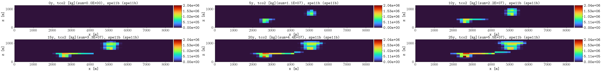
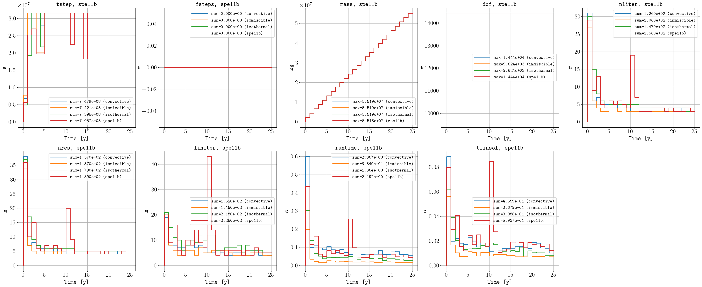
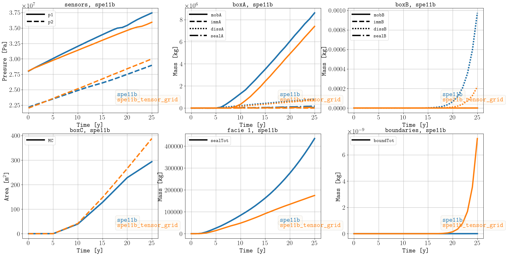
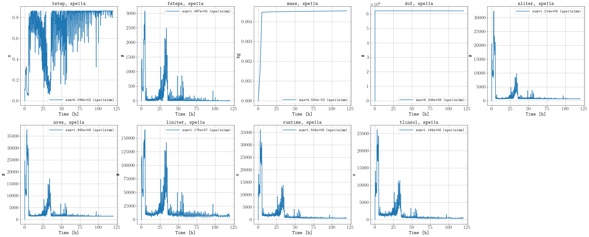
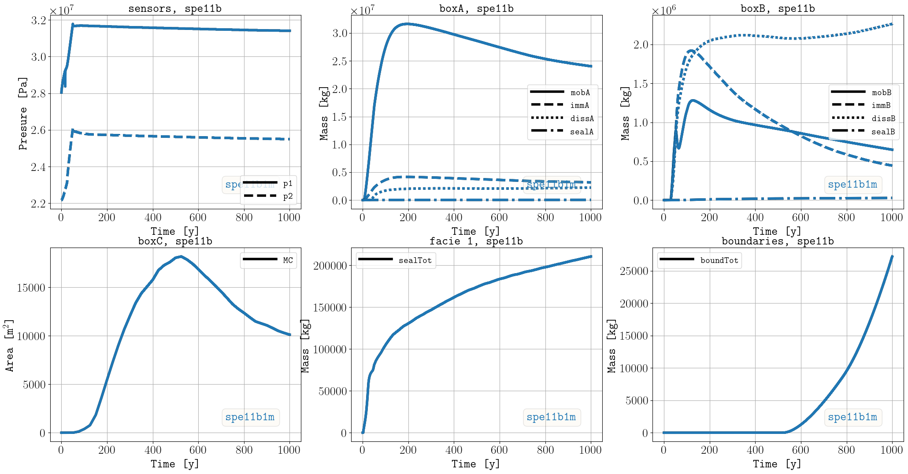

********
Examples
********

===========
Hello world 
===========

The `examples/hello_world <https://github.com/OPM/pyopmspe11/blob/main/examples/hello_world>`_ folder contains configuration files
with low grid resolution and shorter injetion times (for initial testing of the framework). For example, by executing:

.. code-block:: bash

    pyopmspe11 -i spe11b.txt -o spe11b -m all -g all -t 5 -r 50,1,15 -w 1

The following is one of the figures generated related to the CO2 mass in the domain over time (i.e., the simulations results from
the corner-point grid mapped to the equidistance reporting grid of 50 x 15 as defined by the -r flag):

Let us now change the grid type from corner-point to tensor in line 7 of the configuration file.
Then, we run the simulations and we save the results in a different output folder:

.. code-block:: bash

    pyopmspe11 -i spe11b.txt -o tensor -m deck_flow_data -g performance_sparse -t 5 -r 50,1,15 -w 1

Here we have just set the framework to generate the deck, run the simulations, and generate the performance and sparse data.
Then, to visualize the comparison between both runs, this can be achived by executing:

.. code-block:: bash

    pyopmspe11 -c spe11b

The following are some of the figures generated in the compare folder:

This example uses a very coarser grid to run fast. See the following section for finer grids.

============
Presentation 
============

Using the same grid size for the reporting of the results in the SPE11 description, the following computational times
were reported for the 2023 SPE Reservoir Simulation Conference (see the presentation `here <https://github.com/Simulation-Benchmarks/11thSPE-CSP/blob/main/description/SPE11%20CSP.pdf>`_, 
where you can also see some of the preliminary simulation results using OPM Flow):

.. code-block:: yaml

    Case      Dimensions [m]      Max. grid size [m]   No. grid cells  Total no. cells  No. active cells   Solver time step [d]¨  Total simulation time [s]
    spe11a^   [2.8,  0.01,  1.2]  [0.01, 0.01, 0.01]    [280, 1, 120]            33600             31034                   1e-5                    2118.30
    spe11b^*  [8400,    1, 1200]  [10,      1,   10]    [842, 1, 120]           101040             93318                     50                    1420.15
    spe11c^*  [8400, 5000, 1350]  [50,     50,   10]  [170, 100, 120]          2040000           1885200                     50                   25450.68

    ^ All three cases were run with 70 MPI processes and 2 threads per MPI process. i.e., 140 cpu cores.
    * spe11b and spe11c have an extra layer [1 m] of grid cells on the left and right boundaries to include the buffer volume  
    ¨ The solver time step is the maximum value allowed by the simulator

The `examples/finner_grids <https://github.com/OPM/pyopmspe11/blob/main/examples/finner_grids>`_ folder contains configuration files
with grid size of the same order and finner as requested for reporting the spatial data in the benchmark, as well as the required injection schedules. 

===============================
SPE11A in a 1 mm Cartesian grid 
===============================

In a 1 mm Cartesian grid for the spe11a `(spe11a1mm.txt) <https://github.com/OPM/pyopmspe11/blob/main/examples/finner_grids/spe11a1mm.txt>`_, by executing:

.. code-block:: bash

    pyopmspe11 -i spe11a1mm.txt -o spe11a1mm -m all -g all -t 1 -r 280,1,120 -w 0.16666666666666666

the following are some of the generated figures:

.. figure:: figs/spe11a_sparse_data.png

    Sparse data.

    Performance data.

.. figure:: figs/spe11a_performance_detailed.png

    Detailed performance data.

.. figure:: figs/spe11a_tco2_2Dmaps.png

    Dense data for the CO2 mass (in the 1 cm size, tho the simulations are runned at 1 mm size).

==============================
SPE11B in a 1 m Cartesian grid 
==============================

The following are simulation results in a 1 m Cartesian grid `(spe11b1m.txt) <https://github.com/OPM/pyopmspe11/blob/main/examples/finner_grids/spe11b1m.txt>`_, 
and the animation in the `main page <https://github.com/OPM/pyopmspe11/blob/main>`_ was generated using these results (the inizialization time of 1000 years was 
skipped and the results were printed ever 25 years instead of 5 years):

.. code-block:: bash

    pyopmspe11 -i spe11b1m.txt -o spe11b1m -m all -g all -r 840,1,120 -t 25 -w 0.1

    Sparse data in the 1 m Cartesian grid.

.. figure:: figs/spe11b_performance_1m.png

    Performance data in the 1 m Cartesian grid.