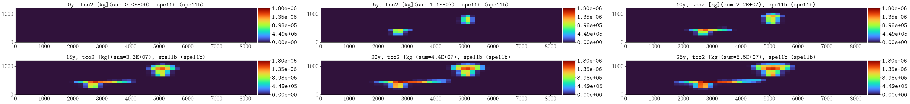
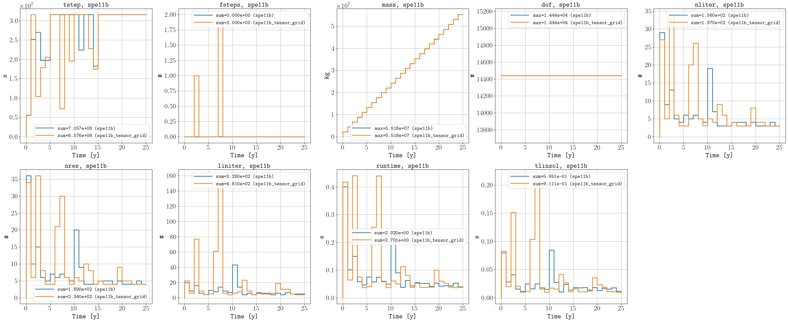

********
Examples
********

===========
Hello world 
===========

The `examples/hello_world <https://github.com/OPM/pyopmspe11/blob/main/examples/hello_world>`_ folder contains configuration files
with low grid resolution and shorter injection times (for initial testing of the framework). For example, by executing:

.. code-block:: bash

    pyopmspe11 -i spe11b.txt -o spe11b -m all -g all -t 5 -r 50,1,15 -w 1

The following is the figure `spe11b_tco2_2Dmaps`, which shows the CO2 mass in the domain over time (i.e., the simulations results from
the corner-point grid mapped to the equidistance reporting grid of 50 x 15 as defined by the -r flag). You can
compare your example results to this figure to evaluate if your example ran correctly:

Using the :ref:`toml` format, the previous run is equivalent to (this requires a Python version of at least 3.11 [due to `tomllib <https://toml.io/en/>`_]):

.. code-block:: bash

    pyopmspe11 -i spe11b.toml -o spe11b -m all -g all -t 5 -r 50,1,15 -w 1

Let us now change the grid type from corner-point to tensor in line 7 of the configuration file.
Then, we run the simulations and we save the results in a different output folder:

.. code-block:: bash

    pyopmspe11 -i spe11b.txt -o tensor -m deck_flow_data -g performance_sparse -t 5 -r 50,1,15 -w 1

Here we have just set the framework to generate the deck, run the simulations, and generate the performance and sparse data.
Then, to visualize the comparison between both runs, this can be achived by executing:

.. code-block:: bash

    pyopmspe11 -c spe11b

The following are some of the figures generated in the compare folder:

.. figure:: figs/spe11b_sparse_data.png

This example uses a very coarser grid to run fast. See the following section for finer grids. 

==============================
Before the 13.06.2024 workshop 
==============================
The results below are the ones presented in the second CSP workshop. There have been two bug fixes that change
some of the results (see `this <https://github.com/OPM/pyopmspe11/pull/54>`_ and `this PR <https://github.com/OPM/pyopmspe11/pull/55>`_).
See the results in :doc:`benchmark <./benchmark>` for the final results. 

------
SPE11A
------

In a 1 mm Cartesian grid for the spe11a `(spe11a1mm.txt) <https://github.com/OPM/pyopmspe11/blob/main/examples/finner_grids/spe11a1mm.txt>`_
and in a 1 cmish corner-point grid `(spe11a_cp_1cmish.txt) <https://github.com/OPM/pyopmspe11/blob/main/examples/finner_grids/spe11a_cp_1cmish.txt>`_:

.. code-block:: bash

    pyopmspe11 -i spe11a1mm.txt -o spe11a1mm -m all -g all -t 1 -r 280,1,120 -w 0.16666666666666666
    pyopmspe11 -i spe11a_cp_1cmish.txt -o spe11a_cp_1cmish -m all -g all -t 1 -r 280,1,120 -w 0.16666666666666666
    pyopmspe11 -c spe11a
    

.. figure:: figs/spe11a_masses.png

    Final CO2 mass in the reporting grid of 1 cm size for (left) spe11a1mm and (right) spe11a_cp_1cmish.

.. figure:: figs/spe11a_performance.png

    Performance data.

.. figure:: figs/spe11a_sparse_data.png

    Sparse data.

------
SPE11B
------

The following are simulation results in a 1 m Cartesian grid `(spe11b1m.txt) <https://github.com/OPM/pyopmspe11/blob/main/examples/finner_grids/spe11b1m.txt>`_, 
as well as for a 10 m Cartesian grid `(spe11b10m.txt) <https://github.com/OPM/pyopmspe11/blob/main/examples/finner_grids/spe11b10m.txt>`_ which is the grid 
resolution for the reporting of dense data in the benchmark:

.. code-block:: bash

    pyopmspe11 -i spe11b1m.txt -o spe11b1m -m all -g all -r 840,1,120 -t 5 -w 0.1
    pyopmspe11 -i spe11b10m.txt -o spe11b10m -m all -g all -r 840,1,120 -t 5 -w 0.1
    pyopmspe11 -c spe11b

.. figure:: figs/spe11b_sparse_data_1m-10m.png

    Sparse data.

.. figure:: figs/spe11b_performance_1m-10m.png

    Performance data.

.. image:: ./figs/animation.gif

------
SPE11C
------

The following are simulation results in a corner-point grid `(spe11c_cp.txt) <https://github.com/OPM/pyopmspe11/blob/main/examples/finner_grids/spe11c_cp.txt>`_ with 21729920 active cells
and in a Cartesian grid with the same resolution as in the benchmark reporting data `(spe11c_168_100_120.txt) <https://github.com/OPM/pyopmspe11/blob/main/examples/finner_grids/spe11c_168_100_120.txt>`_:

.. code-block:: bash

    pyopmspe11 -i spe11c_cp.txt -o spe11c_cp -m all -g all -r 168,100,120 -t 0,5,10,15,20,25,30,35,40,45,50,75,100,150,200,250,300,350,400,450,500,600,700,800,900,1000 -w 0.1
    pyopmspe11 -i spe11c_168_100_120.txt -o spe11c_168_100_120 -m all -g all -r 168,100,120 -t 0,5,10,15,20,25,30,35,40,45,50,75,100,150,200,250,300,350,400,450,500,600,700,800,900,1000 -w 0.1
    pyopmspe11 -c spe11c

.. figure:: figs/spe11c_sparse_data.png

    Sparse data.

.. figure:: figs/spe11c_performance.png

    Performance data.

.. image:: ./figs/spe11c.gif

=============================
After the 13.06.2024 workshop 
=============================
For these results, the maximum time step for the simulator during the injection period and after the injeciton period has been
restricted after looking to the debug files to reduce the number of time step chops and mass conservation issues. We welcome
PRs with configuration files with better tunning. "CP" are the results in a corner-point grid, while "CART" in a Cartesian grid.  

------
SPE11A
------

.. figure:: figs/spe11a_performance_new.png

.. figure:: figs/spe11a_sparse_data_new.png

.. image:: ./figs/spe11as.gif

------
SPE11B
------

.. figure:: figs/spe11b_performance_new.png

.. figure:: figs/spe11b_sparse_data_new.png

.. image:: ./figs/animationspe11b.gif

------
SPE11C
------

.. figure:: figs/spe11c_performance_new.png

.. figure:: figs/spe11c_sparse_data_new.png

.. image:: ./figs/animationspe11c.gif
