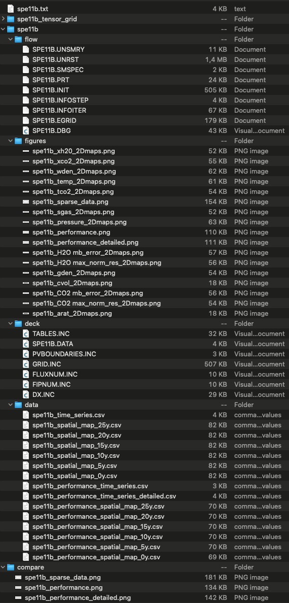

=============
Output folder
=============

The following screenshot shows the generated files in the selected output folder after 
executing **pyopmcsp11**.

    Generated files after executing **pyopmcsp11**.

The simulation results are saved in the output folder, and
`ResInsight <https://resinsight.org>`_ can be used for the visualization.
In addition, some figures are plotted in png format in the postprocessing folder.
Then after running **pyopmcsp11**, one could modify the generated OPM related files and 
run directly the simulations calling the Flow solvers, e.g., to add tracers 
(see the OPM Flow documentation `here <https://opm-project.org/?page_id=955>`_).

.. note::
    Currently the figures in the postprocessing folder are generated only for cartesian
    grids and the computation of mass is for the immiscible model. The calculator in ResInsight
    can be used to visualize quantities such as the mass of the dissolve CO2 in the water phase. 